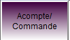
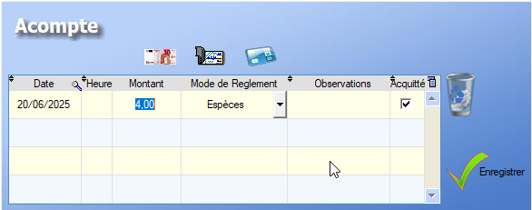
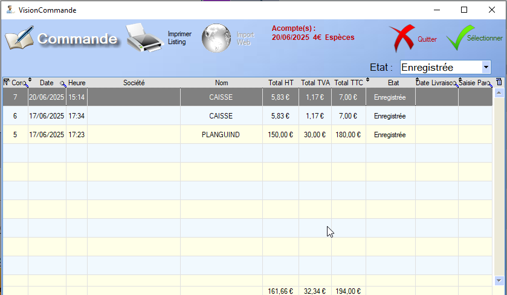

# Commande et Acompte

L'utilisateur peut générer une commande donnant potentiellement suite à un acompte directement via la caisse en utilisant ce bouton : 

Trois options s'offrent alors à lui :

## Nouvelle Commande

Le logiciel génère une nouvelle [Commande](gestion/commande.md) à partir des articles de la vente et du potentiel client sélectionné.

Une fois la commande générée, le logiciel propose d'enregistrer un acompte :

Le logiciel propose de choisir le **montant** ainsi que le **mode de règlement** de l'acompte.

  La poubelle permet de supprimer l'acompte

La case _Acquittée_ sur la droite de la ligne peut être décochée si l'acompte n'a pas encore été réglé. 

Une fois l'acompte défini, un **clic** sur valider permet d'enregistrer l'acompte et la commande par la même occasion.

## Rappel Commande

La table ouverte via **Rappel Commande** permet de visualiser les commandes qui n'ont pas encore été facturées afin de les ouvrir dans la caisse.

  L'outil **loupe** permet de rechercher , colonne par colonne, une valeur au sein de la table.

L'**acompte** potentiellement associé à la commande sélectionnée apparaît en haut à droite de la table.

## Modifier Commande

Pour modifier une commande ouverte via l'outil **Rappel Commande**, l'utilisateur peut effectuer les mêmes opérations que l'ors d'une vente classique.

Cependant, une fois une commande rappelée, l'outil **Modifier commande** permet de rouvrir la fenêtre des acomptes en **mode édition**.

