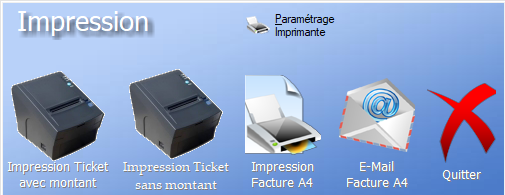

# Enregistrement d'une Vente

Cette section a pour but de détailler le processus d'une vente, en expliquant les différentes options disponibles à chaque étape.

**Attention** : Assurez-vous d'avoir pris connaissance de la section [Interface de caisse](interfaceCaisse.md) avant d'avancer dans celle-ci.

## Choix des Articles

Le choix des articles de la vente se fait via le menu 1 : Objets de la vente.

Une fois les articles choisis, ceux si apparaissent dans le menu 2 : Etat de la vente.

L'utilisateur doit ensuite choisir les **quantités** vendues pour chaque article via ce même menu.

Une fois tous les articles choisis, l'utilisateur peut **finaliser la commande**.

## Finaliser la commande

Pour finaliser une commande, l'utilisateur doit choisir un [Mode de paiement](modePaiement.md).

Une fois le règlement choisi, l'utilisateur doit choisir le **ticket** qu'il souhaite imprimer :

 

Les différents **tickets** sont détaillés dans la section [Gestion Tickets](gestionTickets.md).

La commande est ensuite enregistrée et finalisée.

## Options supplémentaires

L'utilisateur dispose également de quelques outils **optionnels**, permettant de développer es caractéristiques de la commande.

Ceux-ci sont détaillés, avec les outils permettant d'interagir avec le logiciel directement via la caisse, dans la section 3 : Options supplémentaires de l'[interface caisse](interfaceCaisse.md)

- **Client** : Permet de spécifier le client à qui la vente est effectuée.
- **Vendeur** : Permet de spécifier le vendeur responsable de la vente
- **Changer le prix** : Permet de modifer le prix de la vente **manuellement**.
- **Remise** : Permet d'ajouter une [remise](remises.md) à la vente.

## Annulation d'une vente

Pour **annuler** une vente, l'utilisateur doit utiliser les boutons violets au bas de l'interface. Leur fonctionnement est détaillé dans la section [Remboursement](remboursements.md).

## Exemple Vidéo

<video width="800" controls>
  <source src="../../videos/venteEx.mp4" type="video/mp4">
  Votre navigateur ne supporte pas la balise vidéo.
</video>

