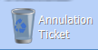
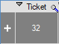
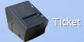
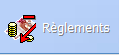

# Gestion des Tickets

Cette section décrit les différentes fonctionnalités offertes par le logiciel vis-à-vis des tickets de caisse.

## Génération des tickets de caisse

Une fois l'enregistrement d'une vente terminée, le logiciel propose plusieurs options afin de documenter celle-ci :

- **Impression ticket avec montant** : Cette option permet, si vous possédez un périphérique adapté, d'imprimer un ticket de caisse classique.
- **Impression ticket sans montant** : Cette option permet, si vous possédez un périphérique adapté, d'imprimer un ticket de caisse, listant les articles mais n'affichant pas le montant de la vente.
- **Impression facture A4** : Cette option permet de générer une [Facture](../gestion/facture.md) imprimable au format A4, à condition d'avoir **renseigné un client** au sein de la vente.
- **E-mail facture A4** : Cette option ouvre une boite mail vous permettant d'écrire un mail automatiquement adressé au client impliqué dans la vente et possèdant en pièce jointe une facture également générée automatiquement. Cette fonction nécessite donc également d'avoir **renseigné un client **au sein de la vente.
- **Quitter** : Cette option permet de finaliser la vente sans générer de ticket ? Le stock du produit est décrémenté et la vente apparaît dans l'historique du client ainsi que dans l'historique des ventes.

## Rappel des tickets

On a détaillé dans la section 3 : Options supplémentaires de la page [Interface caisse](interfaceCaisse.md) la composition du menu **Rappel ticket** mais il est important de spécifier quelques détails d'utilisation.

Lorsque l'utilisateur appuie sur **Quitter** en finalisant sa commande, il n'est pas possible de récupérer son ticket via l'outil rappel ticket.

Quand une vente se finalise par l'impression ou l'envoi par mail d'une facture, le ticket est malgré tout accessible depuis l'outil rappel ticket.

Les **Tickets en attente** ne sont plus disponibles dans la dernière version du logiciel. Pour mettre une vente en suspens, l'utilisateur peut générer une commande via le [bouton correspondant](commandeAcompte.md).

Plusieurs outils sont disponibles via le menu **Rappel Ticket** :

  Ce bouton permet d'_annuler_ un ticket en termes de stock et profit. En effet, le ticket apparaît toujours dans l'historique, cependant, un ticket négatif du même montant (en négatif) et comportant les mêmes articles dans les mêmes quantités (en négatif) est généré.

 Le **+** sur la gauche de chaque ligne permet de visualiser les articles compris dans la vente associée au ticket sélectionné.

  Ce bouton permet de réimprimer le ticket sélectionné via le périphérique adapté.

  Ce bouton permet d'afficher le [mode de règlement](modePaiement.md) du ticket sélectionné. L'utilisateur peut également le modifier. Dans le cas où les modifications entraînent une différence entre le montant des réglements et celui du ticket, l'utilisateur est notifié de cette différence par le logiciel et le ticket garde son montant d'origine.

