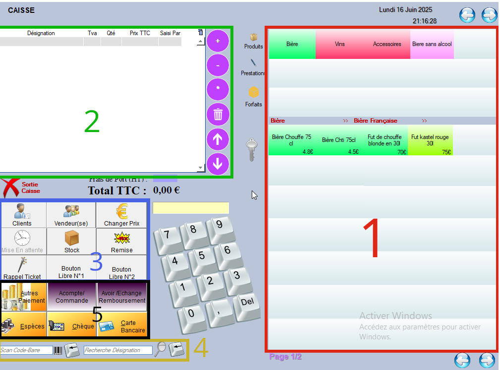
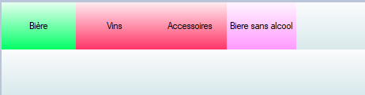
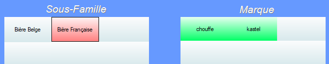

# Interface de Caisse

L'interface de caisse propose énormément d'interactions qui peuvent paraître complexes au premiera bord, mais toutes ces interactions sont simples d'utilisation et suivent un processus logique. Cette sous-section a pour but de détailler la navigation au sein de l'outil **Caisse** du logiciel. Les autres sous-sections de la section **Caisse** servent à expliquer les différents processus usuels de l'outil.

<h2> 1 : Objets de la vente</h2>

La visualisation de droite regroupe tout ce que l'entreprise propose à la vente : [Produits](../produits/listeProduits.md), [Prestations](../prestations/listePrestations.md), [Forfaits](../forfaits/listeForfaits.md).

Une fois une de ces trois options choisie, l'utlisateur accède au menu associé : 

- > **Produits** :
  >
  > Le logiciel nous propose de choisir entres les différentes **familles** de produits définies : 
  >
  >   
  >
  > Une fois la **famille** de produits choisie, un deuxième menu nous permet de choisir une **sous famille** ainsi qu'une **marque**, toujours définies par l'utilisateur : 
  >
  >  
  >
  > Une fois la marque choisie, tous les produits de la dite marque disponibles à la vente sont affichées dans la partie inférieure du premier menu.
  >
  > Il est également possible de s'arrêter au choix de la **sous-famille**, voire de la **famille**, et d'afficher la totalité des produits regroupés dans cette catégorie, sans descendre plus bas dans la hiérarchie. Pour ce faire, il suffit de cliquer sur le bouton suivant avant de sélectionner une **sous-famille** ou une **marque** :     .

- > **Prestations** :
  >
  > Pour les prestations, cela fonctionne de la même manière. Le logiciel liste les différentes **familles**de prestations, et en fonction du choix de l'utilisateur, affiche toutes les prestations appartenant à la **famille**, et disponibles à la vente.

- > **Forfaits**
  >
  > 

<h2> 2 : Etat de la vente</h2>

<h2>  3 : Options supplémentaires</h2>

<h2> 4 : Recherche et Scan</h2>

<h2> 5 : Options de règlement </h2>

