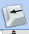
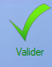
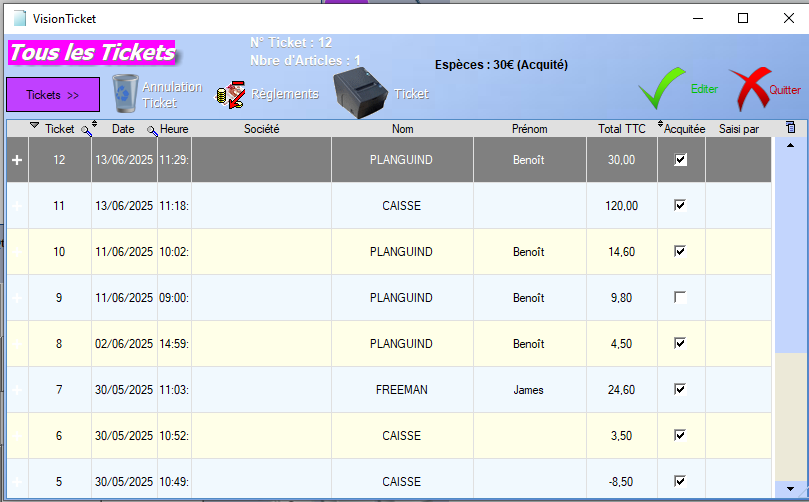
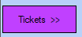

# Interface de Caisse

L'interface de caisse propose énormément d'interactions qui peuvent paraître complexes au premiera bord, mais toutes ces interactions sont simples d'utilisation et suivent un processus logique. Cette sous-section a pour but de détailler la navigation au sein de l'outil **Caisse** du logiciel. Les autres sous-sections de la section **Caisse** servent à expliquer les différents processus usuels de l'outil.

<h2>1 : Objets de la vente</h2>

La visualisation de droite regroupe tout ce que l'entreprise propose à la vente : [Produits](../produits/listeProduits.md), [Prestations](../prestations/listePrestations.md), [Forfaits](../forfaits/listeForfaits.md).

Une fois une de ces trois options choisie, l'utlisateur accède au menu associé : 

- > **Produits** :
  >
  > Le logiciel nous propose de choisir entres les différentes **familles** de produits définies : 
  >
  >   
  >
  > Une fois la **famille** de produits choisie, un deuxième menu nous permet de choisir une **sous famille** ainsi qu'une **marque**, toujours définies par l'utilisateur : 
  >
  >  
  >
  > Une fois la marque choisie, tous les produits de la dite marque disponibles à la vente sont affichées dans la partie inférieure du premier menu.
  >
  > Il est également possible de s'arrêter au choix de la **sous-famille**, voire de la **famille**, et d'afficher la totalité des produits regroupés dans cette catégorie, sans descendre plus bas dans la hiérarchie. Pour ce faire, il suffit de cliquer sur le bouton suivant avant de sélectionner une **sous-famille** ou une **marque** :     .

- > **Prestations** :
  >
  > Pour les prestations, cela fonctionne de la même manière. Le logiciel liste les différentes **familles**de prestations, et en fonction du choix de l'utilisateur, affiche toutes les prestations appartenant à la **famille**, et disponibles à la vente.

- > **Forfaits**
  >
  > 

<h2>2 : Etat de la vente</h2>

Le menu situé en haut à gauche de l'écran répertorie tous les **articles** contenus dans la **vente**. Lorsqu'un article est sélectionné, le **stock restant** est affiché en haut de la table. Différents boutons présents sur la droite de la table permettent d'interagir avec celle-ci :

- <video width="800" controls>
    <source src="../../videos/venteEx.mp4" type="video/mp4">
    Votre navigateur ne supporte pas la balise vidéo.
  </video>
-   Ce bouton permet de **diminuer** de 1 la **quantité** achétée de l'article sélectionné.
-   Ce bouton permet de **multiplier** la **quantité** achetée du produit sélectionné par un montant choisi via le clavier numérique s'ouvrant alors.
-   Ce bouton permet de **supprimer** la ligne de l'article sélectionné de la vente.
-    Les flèches permettent de **naviguer** au sein de la liste d'articles au sein de la vente.

<h2>3 : Options supplémentaires</h2>

### Client

Le bouton **client** ouvre un version simplifiée de la [fenêtre client](../client/listeClients.md), ayant pour but de sélectionner le client impliqué dans la vente. Celle-ci offre beaucoup de possiblités détaillées dans le menu [Liste Clients](../client/listeClients.md). Quelques différences sont cepent à noter :

-   Le menu historique permet uniquement l'accès à l'historique des **Ventes et Prestations**.

-   Ce bouton à la même fonctionnalité que l'outil **loupe** :

  >   L'outil **loupe** permet de rechercher , colonne par colonne, une valeur au sein de la table. 

-   Ce bouton, que l'on retrouve au niveau de quasiment tous les **champs de saisie** permet l'ouverture d'un clavier tactile, à destination des caisses ne possèdant pas de clavier.

-   Ce bouton sert à **ajouter** le client sélectionné à la vente.

### Vendeur(se)

### Changer Prix

Ouvre un clavier numérique permettant de taper le **nouveau prix** à attribuer à la ligne sélectionnée dans l'écran d'état de la vente.

**Attention** : Le prix de la ligne en intégralité est changée, peu importe la quantité d'article. SI vous voulez changez le prix pour une seule unité, il faut le faire avant de modifier la quantité vendue.

### Stock

Permet d'accéder aux quatre menus suivants :

- [Entrée de stock](../stock/entreeStock.md)
- [Sortie de stock](../stock/sortieStock.md)
- [Etat du stock](../stock/etatStock.md)
- [Nouveau Produit](../produits/ficheProduits.md)

### Remise

Permet de définir une remise sur la vente. Une liste d'options s'offre à l'utilisateur :

- Remise XXX% sur ticket : Applique une remise de XXX% sur la somme totale du ticket.
- Remise XXX% sur article : Applique une remise de XXX% sur le prix de l'article sélectionné dans le menu d'état de la vente.
- Remise % sur article : Ouvre un clavier numérique permettant de taper le pourcentage de notre choix pour une remise appliquée à l'article sélectionné dans le menu d'état de la vente.
- Remise % sur ticket : Ouvre un clavier numérique permettant de taper le pourcentage de notre choix pour une remise appliquée à la somme totale du ticket.
- Remise en Montant (sur Ticket) : Ouvre un clavier numérique permettant de taper le montant fixe de notre choix pour une remise appliquée à la somme totale du ticket.
- Remise en Montant sur article : Ouvre un clavier numérique permettant de taper le montant fixe de notre choix pour une remise appliquée à l'article sélectionné dans le menu d'état de la vente.
- Nouveau prix soldé : Ouvre un claver numérique permettant de redéfinir la somme totale du ticket. La différence entre les deux montants étant ajoutée à la vente en tant que remise.

### Rappel Ticket

Ouvre l'**historique** des tickets générés par la caisse : 

Quand un ticket est **sélectionné**, son numéro ainsi que le nombre d'articles de la vente correspondante apparaissent en haut de la table.

  Ce bouton permet de filter l'affichage au sein de la table en fonction des caractéristiques des tickets. Quatre options s'offrent à l'utilisateur : 

- Tous les tickets : affiche la totalité des tickets.

- Tickets du jour : affiche uniquemennt les tickets générés dans la journée

- Ticket non soldés : affiche uniquement les tickets qui ne sont pas encore **acquittés**.

Les outils restants sont définis dans la section [Gestion des Tickets](gestionTickets.md).

<h2>4 : Recherche et Scan</h2>

Les deux _champs de saisie_ en bas à gauche de l'écran permettent également d'ajouter des objets à la vente. Celui de gauche permet le scan d'un code-barres, à l'aide du périphérique associé. Celui de droite permet simplement de rechercher un produit via sa **désignation**. Les résultats de la recherche apparaîtront dans la partie inférieure du menu 1 : Objets de la vente.

<h2>5 : Options de règlement </h2>

 La dernière partie de l'interface permet de finaliser la commande. Les quatre boutons dorés permettent de renseigner le règlement du client en choisissant son [Mode de Paiement](modePaiement.md). Les deux boutons bordeaux restants permettent de générer une commande à partir du ticket ou d'annuler le ticket afin de procéder à un [remboursement](remboursement.md).
