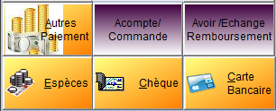
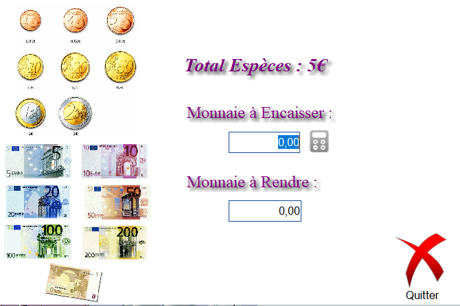
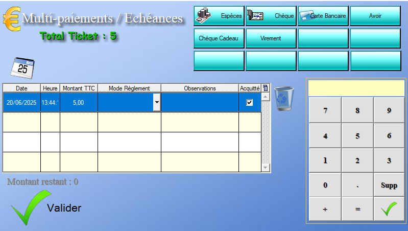

# Mode de paiement

Pour finaliser une vente, l'utilisateur doit choisir le mode de paiement utilisé par le client via les quatre boutons dorés ci-dessous :

- **Chèque** : Le règlement par chèque ne demande aucun renseignement supplémentaire, et permet de finaliser directement la commande.

- **Carte bancaire** : Le règlement par carte bancaire ne demande aucun renseignement supplémentaire, et permet de finaliser directement la commande. 

- **Espèces** : Le règlement par espèces comprend un interface :

  > 
  >
  > L'utilisateur peut alors cliquer  sur les images représentant les différentes formes de monnaie disponibles.
  >
  > Le logiciel calcule automatiquement la monnaie à rendre et l'affiche dans le champ dédié.
  >
  > Une fois la totalité des espèces enregistrés, l'utilisateur peut appuyer sur **Quitter** pour finaliser la commande.

- **Autres paiements** :  Pour plus de fonctionnalités, l'utilisateur peut cliquer sur le bouton **Autres paiements** et accéder au menu suivant :

  > 
  >
  > Le menu suivant permet de définir plusieurs paiements pour un seul règlement.
  >
  > Pour chaque paiement, l'utilisateur peut en renseigner le montant via le clavier numérique à droite de la table.
  >
  > Une fois le montant renseigné, l'utilisateur peut choisir le mode de règlement via la flèche dans la case correspondante ou en cliquant sur le bouton en haut à droite del'écran.
  >
  > Une fois tous les paiements définis, un clic sur **Valider** permet de finaliser la vente.
  >
  > Si un des paiements est réglé en espèces, le menu des espèces décrit plus haut s'ouvrira avant de pouvoir clôre la vente

