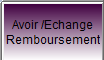
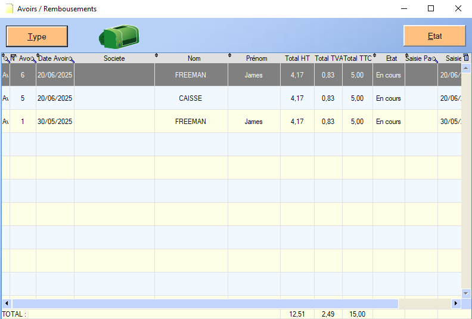

# Remboursements

Une vente déjà effectuée peut être sujet à une annulation, toujours via l'outil **Caisse**.

Pour **annuler** une vente, l'utilisateur doit choisir les **articles** susceptibles au remboursement, de la même manière que lors de la création d'une vente.

Une fois les **articles** choisis, plusieurs modes de remboursements sont disponibles via le bouton suivant :

## Remboursement

La première option après un **clic** est _Créer Remboursement_. 

L'utilisateur doit alors choisir un **mode de paiement**.

Une fois le **mode de paiement** choisi, le remboursement est considéré comme effectué et les quantités des articles remboursés sont ajoutées au stock.

## Avoir

Le logiciel propose également de **créer un avoir**, visible par la suite dans la section [Avoirs](../gestion/avoir.md.)

Si un **client** est sélectionné, l'avoir sera généré au nom du client.

Sinon, celui sera généré par défaut au nom de la **Caisse**.

Le logiciel permet également d'ouvrir le menu _Rappel Avoir_. Ce menu liste les différents avoirs et remboursement déjà effectués :

Les deux boutons au dessus de la table permettent de **trier** l'affichage en fonction tu type (avoir/remboursement) et de l'état (en cours/soldé).

## Echange/Remboursement

L'option échange/remboursement transforme les montants et quantités des différents articles en montants négatifs. Cette option permet d'enregister les coûts en tant que bénéfices et les quantités en tant qu'entrées de stock.

Deux options d'échange/remboursement sont disponibles :

- Ticket : applique la modification à toutes les lignes de la vente.
- Article : applique la modificiation à la ligne de l'article sélectionné.

Pour finaliser un **échange**, il suffit d'ajouter un article à la vente, de la même manière que lors d'une vente lambda.

