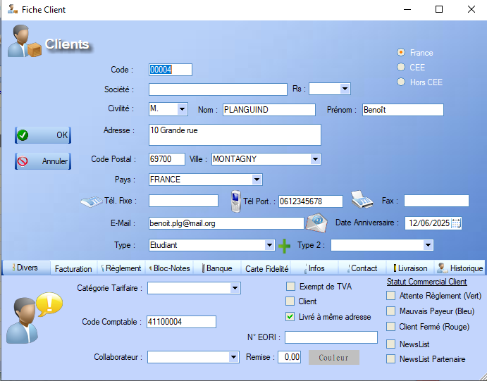

# Fiche Client

La fiche client présente toutes les caracéristiques définies lors de la création du client en premier plan.

L'interface nous offre la possibilité de dénifir un **type** de client (principal et secondaire). Pour ce faire, il suffit de renseigner un **intitulé** désignant ce type de client ainsi qu'un **code comptable** (optionnel). La création de différents types de clients permet de définir des **catégories tarifaires**, ainsi que de **filtrer** l'affichage des clients dans les différents menus.

En bas de l'interface, un certain nombre d'**onglets** s'offent à l'utilisateur: 

- Les onglets _Règlement_ ainsi que _Banque_ permettent la définition des préférences de paiement du client.
- L'onglet _Divers_ permet de gérer des caractéristiques plus précises liées au client : 
- L'onglet _Facturation_ permet de rentrer les informations utiles dans le cat où le client représenté une société.
- L'onglet _Livraison_ permet l'ajout d'informations relatives aux potentiels bons de livraison
- L'onglet _Carte fidélité_ permet d'activer une carte de fidélité liée au client : 
- L'onglet _Infos_ n'offre pas d'interaction mais donne accès au chiffres d'affaire généré par ce client.
- L'onglet _Historique_ donne accès à toutes les ventes/commandes impliquant le dit client.
- L'onglet _Bloc-Notes_ joue le rôle de post-it et mermet d'ajouter une annotation quelconque à la fiche.
- Enfin, l'onglet _Contact_ liste les différents moyens de [contacts](##contacts) du client et permet d'en ajouter.

