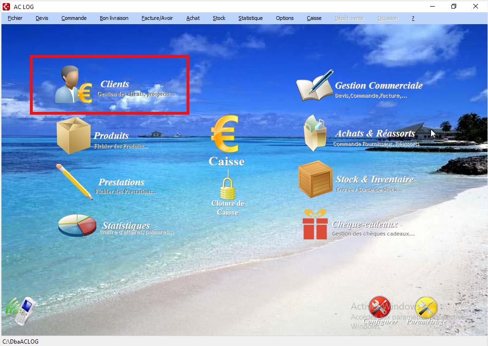
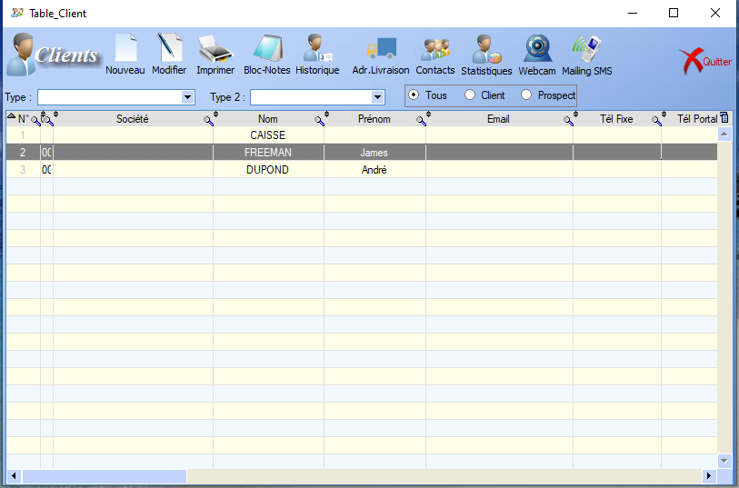
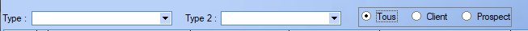
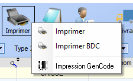
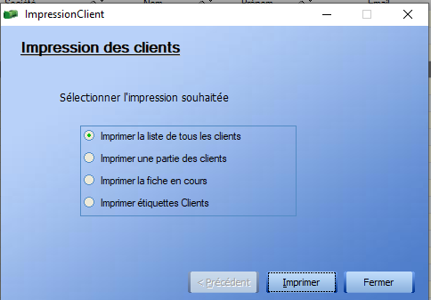
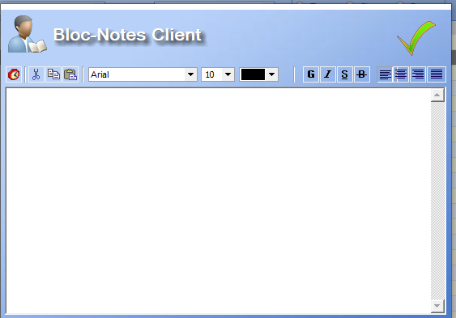
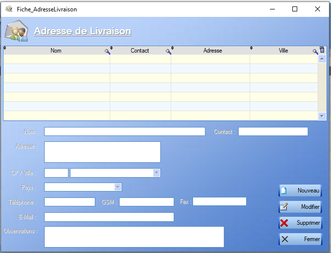
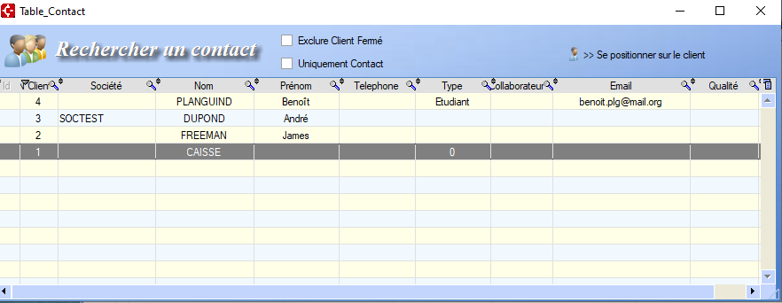
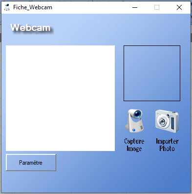
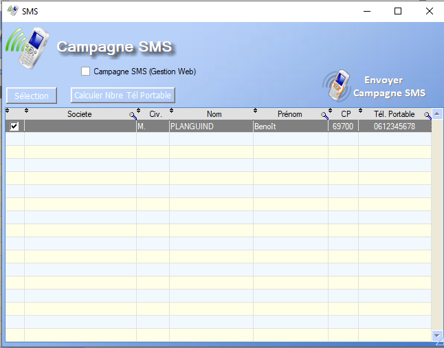

# Liste des clients

Cette section présente et explique le fonctionnement ainsi que les différentes fonctionnalités de l'outil de gestion des clients accessibles depuis le menu de base via ce bouton : 

A l'ouverture, le menu clients affiche un tableau listant les différents clients déjà enregistrés ainsi que leurs différentes caractéristiques.

  L'outil **loupe** permet de rechercher , colonne par colonne, une valeur au sein de la table.

Un double-clic sur un des clients donne accès à sa [Fiche Client](#ficheClients.md).

Le menu est également muni de quelques filtres, situés au dessus du tableau :

Les deux premiers filtres influencent sur les [types des clients](ficheClient.md) et le dernier sur son statut.

## Modifier

L'outil de modificiation ouvre simplement la fiche client. L'utilisateur peut alors modifier tous les champs modifiables et ajouter de potentielles informations manquantes.

## Imprimer

Il existe trois types d'impression.

**IMPRIMER**

Un clic sur le bouton _Imprimer_ nous donne accès à quatre options: 

- Imprimer la liste de tous les clients : 

  > Imprime le résumé de la fiche de chaque client, une par page

- Imprimer une partie des clients

  > Filtre les clients à imprimer en fonction de leur nom et du nom de leur société

- Imprimer la fiche en cours

  > Permet l'impression de la fiche client ou des chiffres annules du client sélectionné

- Imprimer étiquettes clients

  > A compléter

**IMPRIMER BDC**

Un clic sur le bouton  _Imprimer BDC_ nous permet de choisir les dates de départ et de fin du [bon de commande]() associé à un client et d'imprimer ce dernier si il existe.

**IMPRIMER GENCODE**

**A completer**

## Bloc-Notes

L'outil _Bloc-Notes_ donne directement accès au bloc-notes de la [Fiche Client](#fiche-client).

## Historique

Le bouton historique donne accès à un menu déroulant permettant de choisir le sujet de l'historique, celui-ci prenant en compte tous les clients définis.

- Historique des [Devis](../gestion/devis.md)

- Historique des [Ventes]()/prestations

  > Ouvre l'historique de toutes les ventes/prestations effectuées pendant une période choisie par l'utilisateur

- Historique des [Commandes](../gestion/commande.md)

- Historique des [Bons de Livraison](../gestion/bdl.md)

- Historique des [Factures](../gestion/facture.md)/[Avoirs](../gestion/avoir.md)

- Historique des [Cheque-cadeaux](../chequeCadeaux/ficheCheque.md)

- Historique des [Abonnements]()

## Adresse de Livraison

Ce bouton ouvre un menu permettant de Créer/modifier/supprimer des coordonées de livraisons indépendamments des clients, réliées à ceux-ci par leur nom :

## Contacts

Ce menu permet d'accéder rapidement aux moyens de contacts associés à tous les clients.

Pour ajouter un contact relié à un client, il faut passer par l'onglet contact de sa [Fiche Client](##fiche client).

## Webcam

Permet l'ajout d'une photo, via la webcam ou un import, associée à un client.

## Mailing SMS

Permet le lancement d'une campagne SMS pour les clients possèdant un numéro de téléphone enregistré. Le lancement d'une campagne SMS nécessite l'achat de crédits SMS reliés au compte utilisateur.

 

## Supprimer

Le clic-droit sur un client nous propose entre autre de le _supprimer_. Un avertissement apparaît. En effet, un client peut être impliqué dans un ou plusieurs processus en cours, tels qu'une facturation ou une livraison, et sa suppression peut entraîner des disfonctonnements vis à vis de ces processus. Il est donc nécessaire de s'assurer que chaque processus impliquant ce client est terminé avant de le _supprimer_.

