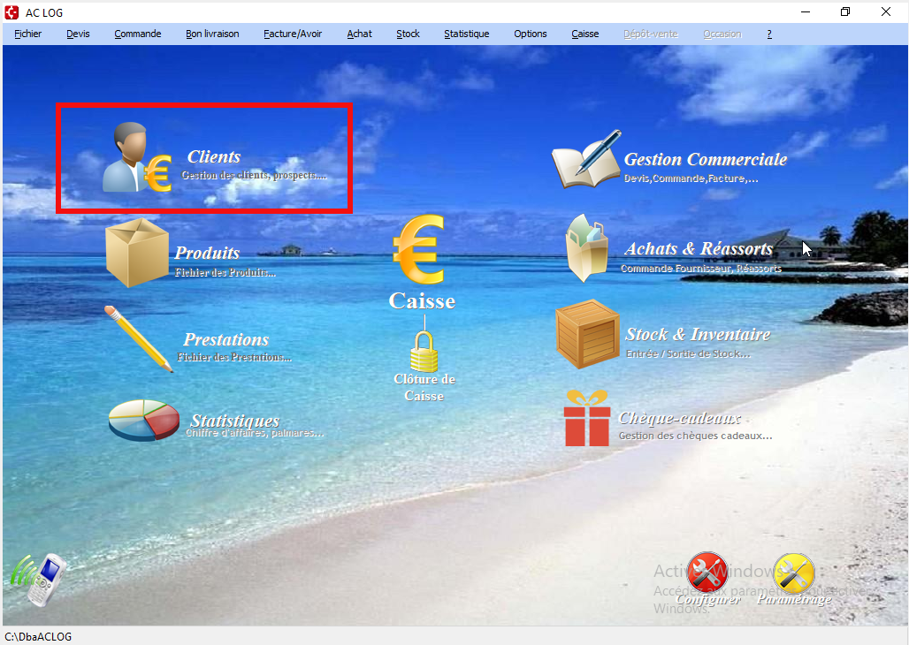
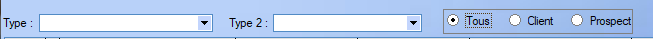
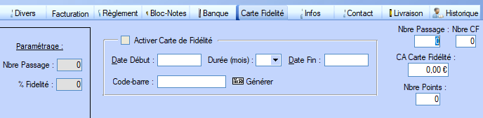
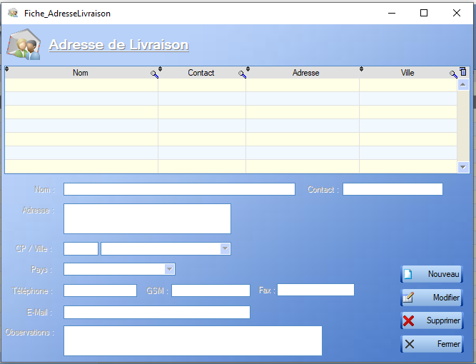
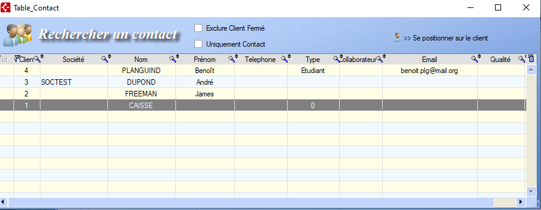
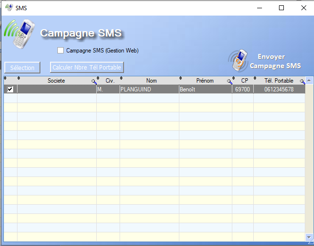

# Clients

Cette section présente et explique le fonctionnement ainsi que les différentes fonctionnalités de l'outil de gestion des clients accessibles depuis le menu de base via ce bouton : 

## Liste des clients

A l'ouverture, le menu clients affiche un tableau listant les différents clients déjà enregistrés ainsi que leurs différentes caractéristiques.

La page ainsi ouverte donne accès à une liste de fonctionnalités plus ou moins complexes :

- [Nouveau](#nouveau)
- [Modifier](#modifier)
- [Imprimer](#imprimer)
- [Bloc-Notes](#bloc-notes)
- [Historique](#historique)
- [Adresse de livraison](#adresse-de-livraison)
- [Contacts](#contacts)
- [Statistiques](#statistiques)
- [Webcam](#webcam)
- [Mailing SMS](#mailing-sms)

Un double-clic sur un des clients donne accès à sa [Fiche Client](##fiche client).

De plus, un clic-droit sur un des clients listés permet d'interagir avec le dit client. Certaines de ces interactions sont communes au menu de base, mais quelques-unes d'entres elles sont disponibles uniquement via ce biais :

- [Supprimer](##supprimer)
- [Relevé de compte](##relevé de compte)
- [Import/Export](##import/export)
- [Mailing](#mailing)

Le menu est également muni de quelques filtres, situés au dessus du tableau :

Les deux premiers filtres influencent sur les [types des clients](##Types) et le dernier sur son statut.

## Fiche Client

La fiche client présente toutes les caracéristiques définies lors de la création du client en premier plan.

En bas de l'interface, un certain nombre d'onglets s'offent à nous : 

- Les onglets _Règlement_ ainsi que _Banque_ permettent la définition des préférences de paiement du client.
- L'onglet _Divers_ permet de gérer des caractéristiques plus précises liées au client : 
- L'onglet _Facturation_ permet de rentrer les informations utiles dans le cat où le client représenté une société.
- L'onglet _Livraison_ permet l'ajout d'informations relatives aux potentiels bons de livraison
- L'onglet _Carte fidélité_ permet d'activer une carte de fidélité liée au client : 
- L'onglet _Infos_ n'offre pas d'interaction mais donne accès au chiffres d'affaire généré par ce client.
- L'onglet _Historique_ donne accès à toutes les ventes/commandes impliquant le dit client.
- L'onglet _Bloc-Notes_ joue le rôle de post-it et mermet d'ajouter une annotation quelconque à la fiche.
- Enfin, l'onglet _Contact_ liste les différents moyens de [contacts](##contacts) du client et permet d'en ajouter.

## Modifier

L'outil de modificiation ouvre simplement la fiche client. L'utilisateur peut alors modifier tous les champs modifiables et ajouter de potentielles informations manquantes.

## Imprimer

Il existe trois types d'impression.

### Imprimer

Un clic sur le bouton _Imprimer_ nous donne accès à quatre options: 

- Imprimer la liste de tous les clients : 

  > Imprime le résumé de la fiche de chaque client, une par page

- Imprimer une partie des clients

  > Filtre les clients à imprimer en fonction de leur nom et du nom de leur société

- Imprimer la fiche en cours

  > Permet l'impression de la fiche client ou des chiffres annules du client sélectionné

- Imprimer étiquettes clients

  > A compléter

### Imprimer BDC

Un clic sur le bouton  _Imprimer BDC_ nous permet de choisir les dates de départ et de fin du [bon de commande]() associé à un client et d'imprimer ce dernier si il existe.

### Imprimer GenCode

**A completer**

## Bloc-Notes

L'outil _Bloc-Notes_ donne directement accès au bloc-notes de la [Fiche Client](#fiche-client).

## Historique

Le bouton historique donne accès à un menu déroulant permettant de choisir le sujet de l'historique, celui-ci prenant en compte tous les clients définis.

- Historique des [Devis]()

- Historique des [Ventes]()/prestations

  > Ouvre l'historique de toutes les ventes/prestations effectuées pendant une période choisie par l'utilisateur

- Historique des [Commandes]()

- Historique des [BDL]()

- Historique des [Factures]()/[Avoirs]()

- Historique des [Cheque-cadeaux]()

- Historique des [Abonnements]()

## Adresse de Livraison

Ce bouton ouvre un menu permettant de Créer/modifier/supprimer des coordonées de livraisons indépendamments des clients, réliées à ceux-ci par leur nom :

## Contacts

Ce menu permet d'accéder rapidement aux moyens de contacts associés à tous les clients.

Pour ajouter un contact relié à un client, il faut passer par l'onglet contact de sa [Fiche Client](##fiche client).

## Webcam

Permet l'ajout d'une photo, via la webcam ou un import, associée à un client.

## Mailing SMS

Permet le lancement d'une campagne SMS pour les clients possèdant un numéro de téléphone enregistré.

 

## Supprimer

Le clic-droit sur un client nous propose entre autre de le _supprimer_. Un avertissement apparaît. En effet, un client peut être impliqué dans un ou plusieurs processus en cours, tels qu'une facturation ou une livraison, et sa suppression peut entraîner des disfonctonnements vis à vis de ces processus. Il est donc nécessaire de s'assurer que chaque processus impliquant ce client est terminé avant de le _supprimer_.

