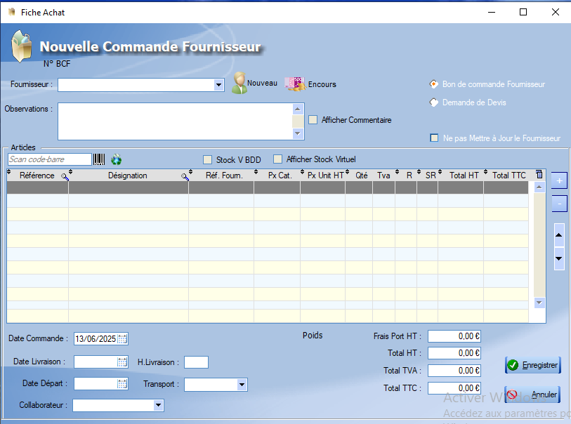

# Fiche Commande Fournisseur

La fiche associée à une commande founissuer contient toutes ses caractéristiques :

  L'outil **loupe** permet de rechercher , colonne par colonne, une valeur au sein de la table.

Une commande fournisseur contient deux points d'information:

- > [Fournisseur](../fournisseurs/ficheFournisseurs.md)
  >
  > L'ajout d'un fournisseur à la commande peut se faire via les fournisseurs déjà enregistrés.
  >
  >   Ce bouton permet de définir un nouveau fournisseur

- > [Articles](../produits/ficheProduits.md)
  >
  >   Ce bouton permet d'ajouter un produit déjà enregistré à la liste de produits existants. Il est également possible d'ajouter un produit via un scan du code-barres.
  >
  >   On peut également supprimer un produit de la commande via ce bouton.
  >
  >  Les flèches permettent de naviguer à travers la liste des produits de la commande.

Les différents renseignements restants sont explicites.

 Le bouton **encours** permet de visualiser les encours que l'entreprise doit à chaque fournisseur : 

Le logiciel propose aussi de décider de répercuter ou non la commande sur les [Produits](../produits/ficheProduits.md) ainsi que sur les [Fournisseurs](../fournisseurs/ficheFournisseurs.md).

Lors de la validation d'une commande fournisseur, le logiciel nous propose de _modifier les fiches produits_,  ou de ne pas le faire. :

Un **clic** sur Oui entraînera une modification des stocks du produit à la fin de livraison.

  Cette case permet quant à elle de ne pas mettre à jour l'**historique** fournisseur et de ne pas générer d'**encours** en cas de règlement différé, si la case est **cochée**.

  Cette dernière option permet à l'utilisateur de choisir si il désire générer une **demande de devis** pour le fournisseur ou si il préfère générer directement un **bon de commande fournisseur** au moment de l'enregistrement de la commande.

## Exemple de fiche fournisseur complète

