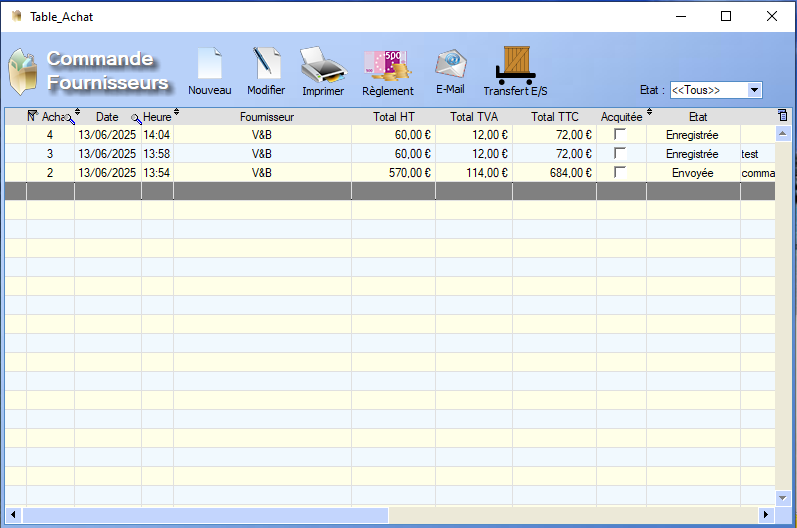
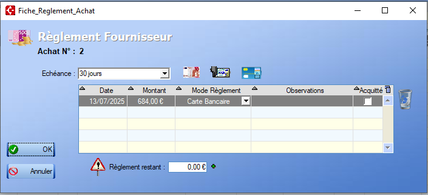
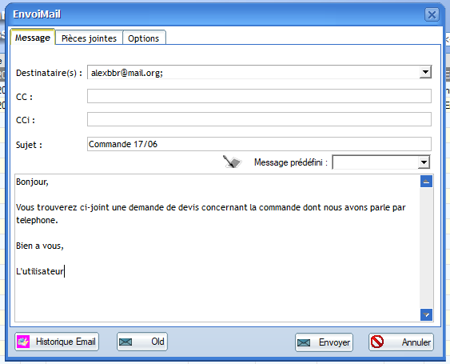
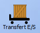

# Liste Commandes Fournisseurs

Au lancement, l'interface de gestion des **commandes fournisseurs** nous affiche la table des commandes :

  L'outil **loupe** permet de rechercher , colonne par colonne, une valeur au sein de la table.

Plusieurs **fonctionnalités** s'offrent à l'utilisateur depuis la table .

## Nouveau

Un **clic** permet de générer une nouvelle [Fiche Commande Fournisseur](ficheCmdFour.md) et de l'enregistrer dans la table.

## Modifier

Un **clic** permet l'ouverture de la [Fiche Commande Fournisseur](ficheCmdFour.md) sélectionnée en mode **édition**.

## Imprimer

La fonction **Imprimer** permet l'impression du document associé à la commande fournisseur :

- Un **bon de commande fournisseur** par défaut.
- Une **demande de devis** si l'option a été sélectionnée dans la [Fiche Commande Fournisseur](ficheCmdFour.md).

## Règlement

L'outil **Règlement** permet de modifier le **mode de paiement**, l'**échéance** ainsi que de cocher la case _Acquitté_ si le règlement a bien eu lieu : 

 La poubelle permet de supprimer un des règlements de la liste.

Lorsque la somme des **règlements** atteint le montant de la commande, cele-ci est marquée comme **acquittée** dans la table.

Il est également possible d'ajotuer des **règlements** directement via le tableau en remplissant **manuellement** les cases.

## E-mail

L'option e-mail permet de générer automatiquement un mail à destination de l'adresse trouvée dans la [Fiche Commande Fournisseur](ficheCmdFour.md).

La pièce jointe est le document généré par l'outil **Imprimer**.

L'utilisateur peut alors rajouter son message ainsi que les renseignements d'un mail classique : 

## Transfert

  Ce bouton permet de transférer la commande sélectionnée directement en [entrée de stock](../stock/entreeStock.md).

