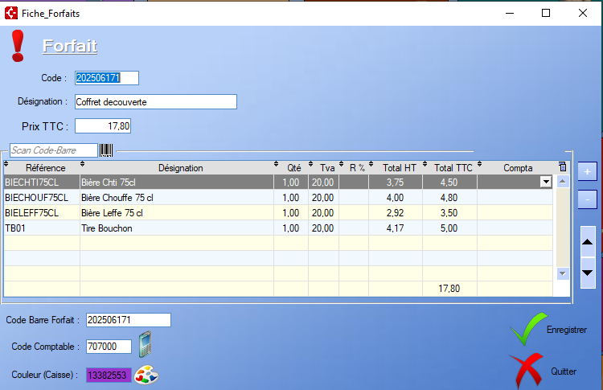

# Fiche Forfait

Un forfait est un moyen de regrouper plusieurs [Produits](../produits/ficheProduits.md) ou [Prestations](../prestations) au sein d'un même article. De ce fait la **fiche forfait** regroupe tous les articles contenus dans dans celui-ci :

Le **Code** sélectionné doit être unique.

  Ce bouton permet d'ajouter un article déjà enregistré à la liste d'articles existants. Il est également possible d'ajouter un article via un scan du code-barres.

  On peut également supprimer un article du forfait via ce bouton.

 Les flèches permettent de naviguer à travers la liste des articles du forfait.

Par défaut, le **prix** du forfait est la somme des prix de tous les article au sein du forfait, **taxe comprise**.

Cependant, il est possible de modifier le prix final du forfait via le champ de saisie au dessus de la table.

  Un **clic** sur la palette permet de choisir une couleur, visible sur la table, mais également au sein de la **Caisse**.

