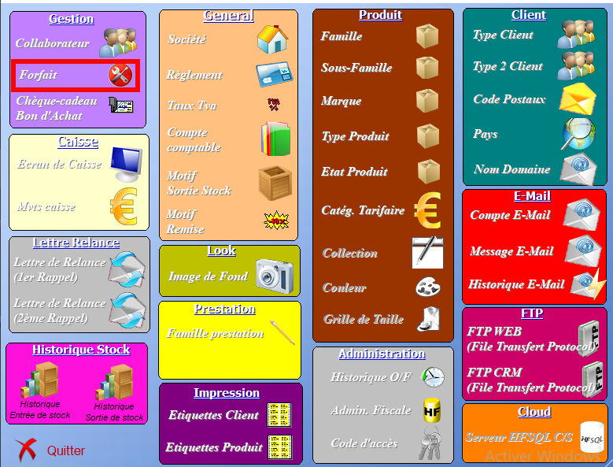
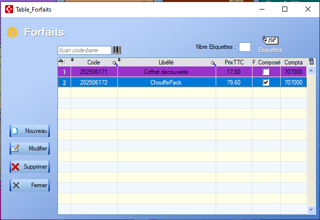

# Liste forfaits

Pour accéder à l'interface de **gestion des forfaits**, l'utilisateur doit passer par le bouton configurer :

  , accessible depuis l'écran d'acceuil.

Depuis le menu **Configurer**, l'accès au menu se fait via le bouton **Forfaits** :

Le menu s'ouvre sur la table suivante :

  L'outil **loupe** permet de rechercher , colonne par colonne, une valeur au sein de la table.

Plusieurs fonctionnalités s'offrent alors à l'utilisateur :

## Nouveau

Permet de créer une nouvelle [Fiche Forfait](ficheForfait.md).

## Modifier

Ouvre la [Fiche Forfait](ficheForfait.md) du forfait sélectionné en mode **édition**.

## Supprimer

Supprime la ligne du forfait sélectionné de la table.

## Fermer

Ferme le menu.

