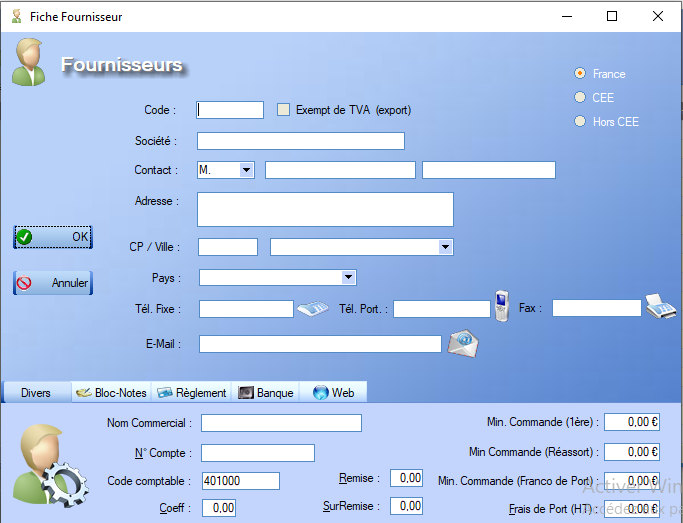

# Fiche fournisseur

## Description

La Fiche Fournisseur regoupe les différentes **caractéristiques** propres à chaque fournisseur :

Le **code** choisi par l'utilisateur doit être unique.

Les **images** associées aux **coordonées** sont purement illustratives, chaque coordonnée doit être indiquée dans le **champ de saisie** correspondant.

En bas de l'interface, plusieurs **onglets** sont proposés à l'utilisateur :

- L'onglet _Divers_ permet d'ajouter un certains nombres de précisions relatives à des domaines variés à la Fiche Fournisseur.
- L'onglet _Bloc-notes_ permet d'annoter la fiche via un **éditeur de texte**.
- L'onglet _Règlement_ permet de renseigner les préférences du fournisseur en matière de **paiement**.
- L'onglet _Web_ offre la possibilité de lier l'URL du site internet du fournisseur ainsi que notre paire **login/password** afin de **A compléter**. 

## Exemple de fiche complète

