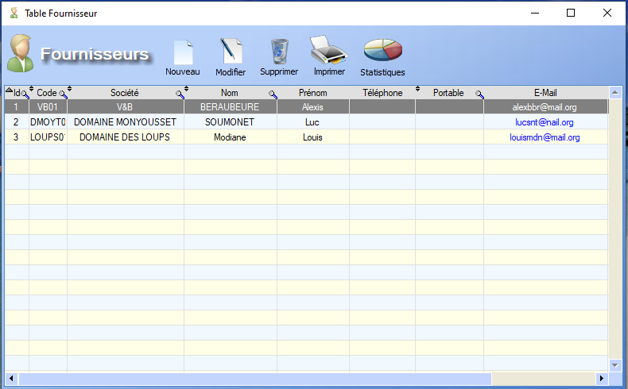

# Liste Fournisseurs

Au lancement, l'interface de gestion des **fournisseurs** nous affiche la table des fournisseurs:

  L'outil **loupe** permet de rechercher , colonne par colonne, une valeur au sein de la table.

Plusieurs **fonctionnalités** s'offrent à l'utilisateur depuis la table .

## Nouveau

Un **clic** permet de générer une nouvelle [Fiche Fournisseur](ficheFournisseur.md) et de l'enregistrer dans la table.

## Modifier

Un **clic** permet l'ouverture de la [Fiche Fournisseur ](ficheFournisseur.md)sélectionnée en mode **édition**.

## Supprimer

Un **clic** permet de supprimer le fournisseur sélectionné de la table.

## Imprimer

La fonction **Imprimer** permet l'impression de fiches clients au format A4. Il est possible d'imprimer :

- Toutes les fiches
- Une partie des fiches (sélection via leur société)
- Uniquement la fche sélectionnée

## Statistiques

**A compléter**

