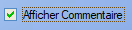

# Gestion commerciale

## Devis

Fiche Devis : 

Un devis contient deux points d'informations principaux : 

- [Client](clients.md)
  > L'ajout d'un client à une commande peut se faire via son nom, par sa société ou par son code. Il est également possible de créer un nouveau client directement via la fiche commande , ou d'en choisir un existant.

- [Produits / Prestations]()

  > Les produits s'ajoutent via la liste de produits existants  ou via un scan du code-barres.
  >
  > L'outil crayon   permet d'ajouter un produit _à la main_ au sein de la commande.
  >
  > On peut également supprimer un produit de la commande via le bouton .

Les différents renseignements restant sont explicites. Il est également possible d'ajouter des observations (visibles ou non par le client) au devis.

## Commandes

Fiche commande :

Une commande contient trois points d'information:

- [Client](clients.md)

  > L'ajout d'un client à une commande peut se faire via son nom, par sa société ou par son code. Il est également possible de créer un nouveau client directement via la fiche commande , ou d'en choisir un existant.

- [Adresse de Livraison](clients.md#adresse-de-livraison)

  > L'adresse de livraison peut s'ajouter via la fiche de commande, on peut également sélectionner une adresse existante ou choisir comme adresse de livraison l'adresse associée au client.

- [Produits / Prestations]()

  > Les produits s'ajoutent via la liste de produits existants  ou via un scan du code-barres.
  >
  > L'outil crayon   permet d'ajouter un produit _à la main_ au sein de la commande.
  >
  > On peut également supprimer un produit de la commande via le bouton .

Les différents renseignements restants sont explicites, les types de commande étant définis par l'utilisateur.

Le bouton  permet d'ajouter des commentaires (visibles ou non par le client ) à la commande.

Enfin le bouton transférer permet la transtion directe vers une [facture](#facture) ou un [bon de livraison](#bon-de-livraison).

Fiche de commande complète :

## Bons de livraison

Un bon de livraison s'organise de la même manière qu'une commande, et dérive souvent directement de celle-ci.

Une commande contient trois points d'information:

- [Client](clients.md)

  > L'ajout d'un client à une commande peut se faire via son nom, par sa société ou par son code. Il est également possible de créer un nouveau client directement via la fiche commande , ou d'en choisir un existant.

- [Adresse de Livraison](clients.md#adresse-de-livraison)

  > L'adresse de livraison peut s'ajouter via la fiche de commande, on peut également sélectionner une adresse existante ou choisir comme adresse de livraison l'adresse associée au client.

- [Articles]()

  > Les articles s'ajoutent via la liste de produits existants  ou via un scan du code-barres.
  >
  > L'outil crayon   permet d'ajouter un produit _à la main_ au sein de la commande.
  >
  > On peut également supprimer un produit de la commande via le bouton .

Les différents renseignements restants sont explicites, les modes de livraison étant définis par l'utilisateur. 

L'outil de recherche permet de rechercher des produits via leur numéro de commande.

Bon de livraison transféré depuis la commande précédente :

## Factures et Avoirs

Une facture, comme un avoir, se construit de la même manière qu'un devis : 

 

## Règlements en attente

