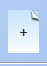
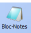
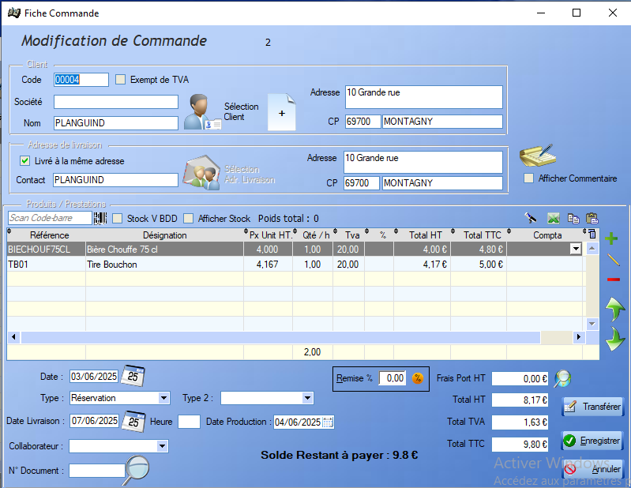
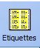
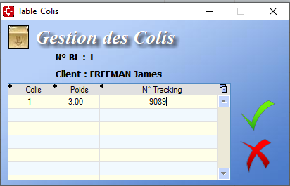
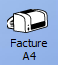
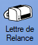
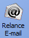
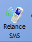

# Gestion commerciale

## Devis

Fiche Devis : 

Un devis contient deux points d'informations principaux : 

- [Client](clients.md)
  > L'ajout d'un client à une commande peut se faire via son nom, par sa société ou par son code. Il est également possible de créer un nouveau client directement via la fiche commande , ou d'en choisir un existant.

- [Produits / Prestations]()

  > Les produits s'ajoutent via la liste de produits existants  ou via un scan du code-barres.
  >
  > L'outil crayon   permet d'ajouter un produit _à la main_ au sein de la commande.
  >
  > On peut également supprimer un produit de la commande via le bouton .

Les différents renseignements restant sont explicites. Il est également possible d'ajouter des observations (visibles ou non par le client) au devis.

Une fois un ou plusieurs devis créées. L'utilisateur peut accéder à la liste des devis :

Depuis cette liste, l'utilisateur peut interagir avec les devis déjà créés. Le bouton modifier  donne accès à la fiche du devis . Le bouton dupliquer permet de créer une copie du devis sélectionné et de l'ajouter à la liste. Le bouton Imprimer  permet la génération d'une version pdf du devis, destinée à l'impression. Le bloc notes  permet d'ajouter des commentaires, reliés à un devis. Le bouton e-mail  permet d'envoyer la version pdf du devis par mail.

## Commandes

Fiche commande :

Une commande contient trois points d'information:

- [Client](clients.md)

  > L'ajout d'un client à une commande peut se faire via son nom, par sa société ou par son code. Il est également possible de créer un nouveau client directement via la fiche commande , ou d'en choisir un existant.

- [Adresse de Livraison](clients.md#adresse-de-livraison)

  > L'adresse de livraison peut s'ajouter via la fiche de commande, on peut également sélectionner une adresse existante ou choisir comme adresse de livraison l'adresse associée au client.

- [Produits / Prestations]()

  > Les produits s'ajoutent via la liste de produits existants  ou via un scan du code-barres.
  >
  > L'outil crayon   permet d'ajouter un produit _à la main_ au sein de la commande.
  >
  > On peut également supprimer un produit de la commande via le bouton .

Les différents renseignements restants sont explicites, les types de commande étant définis par l'utilisateur.

Le bouton  permet d'ajouter des commentaires (visibles ou non par le client ) à la commande.

Enfin le bouton transférer permet la transtion directe vers une [facture](#facture) ou un [bon de livraison](#bon-de-livraison).

Fiche de commande complète :

La liste des commandes offre les mêmes fonctionnalités que la liste des [Devis](#devis). La seule option suppplémentaire est la création d'un acompte  permettant de définir un montant, un mode de règlement, ainsi qu'un commentaire. Pour pouvoir enregister l'acompte, la case _Acquitté_ doit être cochée. Une fois l'acompte enregistré, son montant est soustrait du _Solde Restant à payer_ dans la fiche commande.

La poubelle permet la suppression d'un acompte déjà enregistré.

## Bons de livraison

Un bon de livraison s'organise de la même manière qu'une commande, et dérive souvent directement de celle-ci.

Une commande contient trois points d'information:

- [Client](clients.md)

  > L'ajout d'un client à une commande peut se faire via son nom, par sa société ou par son code. Il est également possible de créer un nouveau client directement via la fiche commande , ou d'en choisir un existant.

- [Adresse de Livraison](clients.md#adresse-de-livraison)

  > L'adresse de livraison peut s'ajouter via la fiche de commande, on peut également sélectionner une adresse existante ou choisir comme adresse de livraison l'adresse associée au client.

- [Articles]()

  > Les articles s'ajoutent via la liste de produits existants  ou via un scan du code-barres.
  >
  > L'outil crayon   permet d'ajouter un produit _à la main_ au sein de la commande.
  >
  > On peut également supprimer un produit de la commande via le bouton .

Les différents renseignements restants sont explicites, les modes de livraison étant définis par l'utilisateur. 

L'outil de recherche permet de rechercher des produits via leur numéro de commande.

Bon de livraison transféré depuis la commande précédente :

La liste des bons de livraisons offre globalement les mêmes possibilités que la liste des [Devis](#devis). En plus, celle-ci permet l'impression d'étiquettes via la bouton étiquettes . Le règlage de la position de départ des étiquettes permet d'imprimer les étiquettes de plusieurs commandes sur la même planche.  Enfin, le bouton colis  permet la gestion des différents colis en cours de livraison via leur numéro de tracking : 

## Factures et Avoirs

Une facture, comme un avoir, se construit de la même manière qu'un devis : 

 

Une fois dans les listes respectives des avoirs/factures, on retrouve des fonctionnalités connues, mais également un outil en plus spécifique à chaque document.

Pour les **Factures**, le logiciel permet d'ajouter un ou plusieurs règlements via le bouton . Une fois un règlement ajouté à la facture, celle-ci est considérée comme partiellement réglée. Quand la somme des règlements atteint le montant de la facture, celle-ci est considérée comme acquittée. Quand la facture provient d'une [Commande](#commande) pour laquelle un acompte a été versé, il est possible de laisser le reste du règlement en suspens, en refusant de  reprendre la saisie :  .

Pour les **Avoirs**, le logiciel permet de calculer le montant de l'avoir restant à consommer via un clic sur le bouton : .

## Transfert

Tous ces documents étant dépendant les uns des autres, il est possible de générer certains d'entre eux depuis d'autres.

Les dépendances se hiérarchisent comme suit :

- Un [Devis](#devis) permet de générer la [Commande](#commandes) ainsi que la [Facture](#factures-et-avoirs) associée.

  > Cette génération se fait via le bouton  

- Une [Commande](#commandes) permet la génération de la [Facture](#factures-et-avoirs) ainsi que du [Bon de Livraison](#bons-de-livraison) associée.

  > Cette génération se fait via le bouton .

- Un [Bon de Livraison](#bons-de-livraison) permet la génération de la [Facture](#factures-et-avoirs) associée.

  > Cette génération se fait via un clic-droit sur le bon de livraison au sein de la liste.

- Une [Facture](#factures-et-avoirs) permet la génération de l'[Avoir](#factures-et-avoirs) associé.

  > Cette génération se fait via un clic-droit sur la Facture au sein de la liste.

### Exemple de transfert

**Devis** :

 

**Commande**:

  

**Facture**:

 

**Avoir** :

  

**Bon de Livraison**:

  

## Règlements en attente

L'outil **Règlements en attente** liste les différentes factures attendant un règlement. La liste contient également les avoirs dont le montant n'a pas encore été intégralement dépensé, le montant restant à dépenser étant indiqué en négatif.

Une liste d'outils servant à relancer les clients concernés par ces règlements est disponible via ce menu .

- On peut générer une facture via .

- On peut générer un Impayé client, indiquant la somme totale que le client doit actuellement à l'entreprise, via .

- On peut générer une lettre de relance via .

  > Il existe deux modèles de lettres de relance. Le modèle 1 correspond à une première relance, tandis que le modèle 2 sert de dernier avertissement avant l'initiation de procédures judiciaires.

- On peut effectuer une relance par e-mail via le bouton . Cette option génère un mail possèdant en pièce jointe une facture ou une lettre de relance, au choix.

- La relance SMS permet de sélectionner les clients à relancer et de les joindre via leur téléphone portable.

