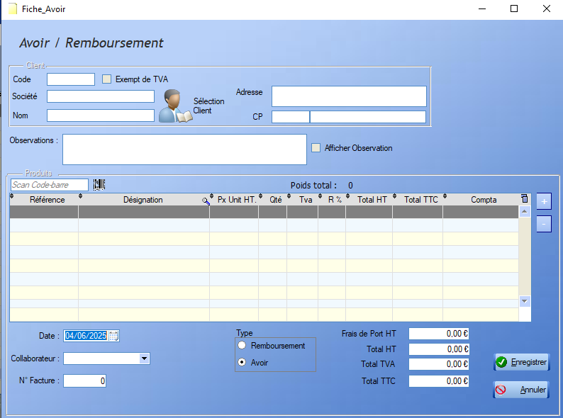
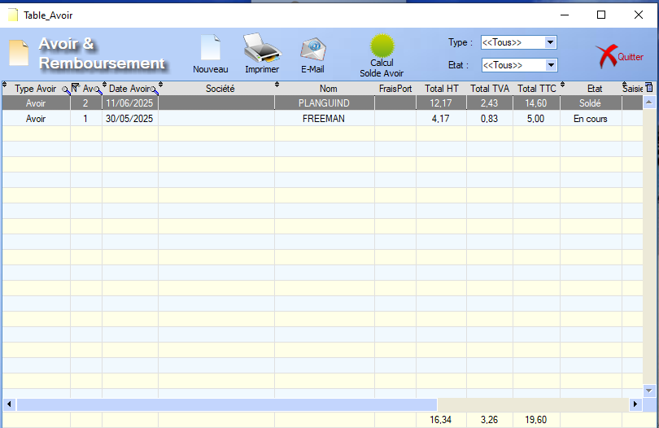
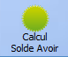

# Avoir

## Fiche Avoir

Un Avoir se construit de la même manière qu'un [Devis](#devis.md) : 

  L'outil **loupe** permet de rechercher , colonne par colonne, une valeur au sein de la table.

## Liste des avoirs

 

  L'outil **loupe** permet de rechercher , colonne par colonne, une valeur au sein de la table.

La liste des avoirs propose un certain nombre de fonctionnalités déjà définies dans la section [Devis](devis.md).

  Pour les **Avoirs**, le logiciel permet de calculer le montant de l'avoir restant à consommer via un clic sur ce bouton.