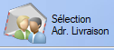

# Bon de Livraison

## Fiche bon de livraison

  L'outil **loupe** permet de rechercher , colonne par colonne, une valeur au sein de la table.

Un bon de livraison s'organise de la même manière qu'une [commande](#commande.md), et dérive souvent directement de celle-ci.

Une commande contient trois points d'information:

- [Client](../client/listeClients.md)

  > L'ajout d'un client à une commande peut se faire via son nom, par sa société ou par son code. Il est également possible de créer un nouveau client directement via la fiche commande , ou d'en choisir un existant.

- [Adresse de Livraison](../client/listeClients.md#adresse-de-livraison)

  > L'adresse de livraison peut s'ajouter via la fiche de commande. 
  >
  >  On peut également sélectionner une adresse existante à l'aide de ce bouton ou choisir comme adresse de livraison l'adresse associée au client.

- [Produits / Prestations]()
  
  >
  >  Ce bouton permet d'ajouter un produit à la liste de produits existants. Il est également possible d'ajouter un produit via un scan du code-barres.
  >
  >    L'outil crayon permet d'ajouter un produit _à la main_ au sein de la commande.
  >
  >   On peut également supprimer un produit de la commande via ce bouton 

Les différents renseignements restants sont explicites, les modes de livraison étant définis par l'utilisateur. 

  L'outil de recherche permet de rechercher des produits via leur numéro de commande.

Bon de livraison transféré depuis la commande précédente :

  L'outil **loupe** permet de rechercher , colonne par colonne, une valeur au sein de la table.

## Liste des bons de livraison

  L'outil **loupe** permet de rechercher , colonne par colonne, une valeur au sein de la table.

La liste des bons de livraisons offre globalement les mêmes possibilités que la liste des [Devis](devis.md). 

 En plus, celle-ci permet l'impression d'étiquettes via la bouton étiquettes . Le règlage de la position de départ des étiquettes permet d'imprimer les étiquettes de plusieurs commandes sur la même planche.  

 Enfin, le bouton colis  permet la gestion des différents colis en cours de livraison via leur numéro de tracking : 

## Transfert

Un [Bon de Livraison](bdl.md) permet la génération de la [Facture](facture.md) associée.

 