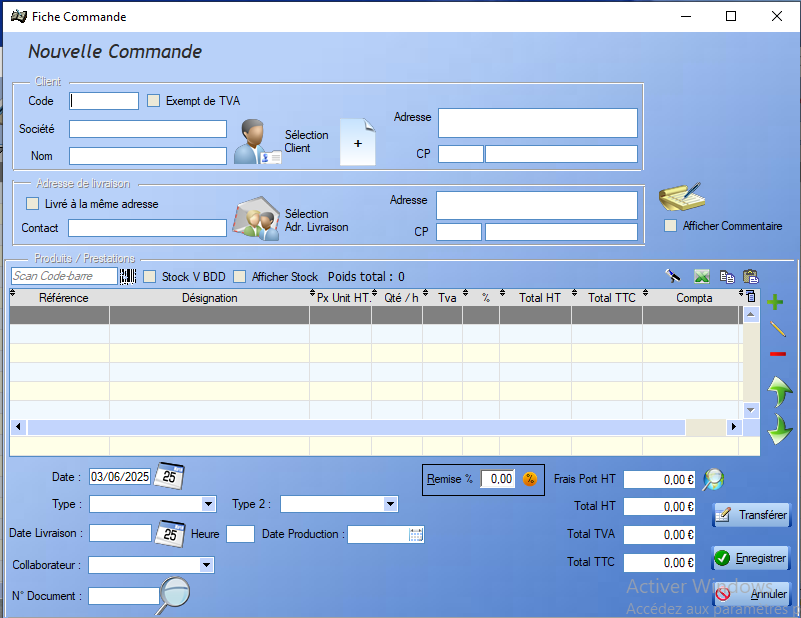
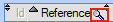
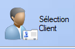
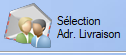
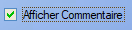
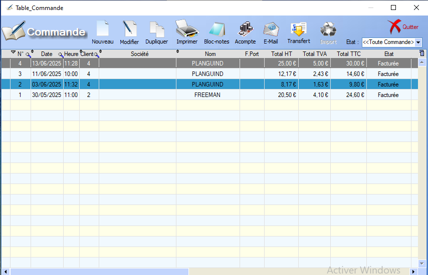
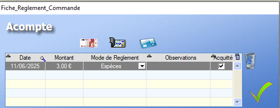
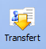

# Commande

## Fiche commande

Fiche commande :

  L'outil **loupe** permet de rechercher , colonne par colonne, une valeur au sein de la table.

Une commande contient trois points d'information:

- [Client](../client/ficheClients.md)

  > L'ajout d'un client à une commande peut se faire via son nom, par sa société ou par son code. Il est également possible de créer un nouveau client directement via la fiche commande , ou d'en choisir un existant.

- [Adresse de Livraison](../clients.md#adresse-de-livraison)

  > L'adresse de livraison peut s'ajouter via la fiche de commande. 
  >
  >  On peut également sélectionner une adresse existante à l'aide de ce bouton ou choisir comme adresse de livraison l'adresse associée au client.

- > [Produits / Prestations]()
  >
  >  Ce bouton permet d'ajouter un produit à la liste de produits existants. Il est également possible d'ajouter un produit via un scan du code-barres.
  >
  >    L'outil crayon permet d'ajouter un produit _à la main_ au sein de la commande.
  >
  >   On peut également supprimer un produit de la commande via ce bouton 

Les différents renseignements restants sont explicites, les types de commande étant définis par l'utilisateur.

 Ce bouton permet d'ajouter des commentaires (visibles ou non par le client ) à la commande.

  Enfin, le bouton transférer permet la transtion directe vers une [facture](facture.md) ou un [bon de livraison](bdl.md).

Fiche de commande complète :

## Liste des commandes

  L'outil **loupe** permet de rechercher , colonne par colonne, une valeur au sein de la table.

La liste des commandes offre les mêmes fonctionnalités que la liste des [Devis](devis.md). 

 La seule option suppplémentaire est la création d'un acompte  permettant de définir un montant, un mode de règlement, ainsi qu'un commentaire. Pour pouvoir enregister l'acompte, la case _Acquitté_ doit être cochée. Une fois l'acompte enregistré, son montant est soustrait du _Solde Restant à payer_ dans la **fiche commande**.

 La poubelle permet la **suppression** d'un acompte déjà enregistré.

## Transfert

Une [Commande](commande.md) permet la génération de la [Facture](facture.md) ainsi que du [Bon de Livraison](bdl.md) associée.

>   Cette génération se fait via ce bouton .

