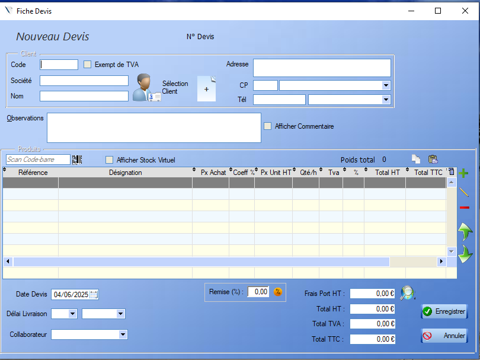
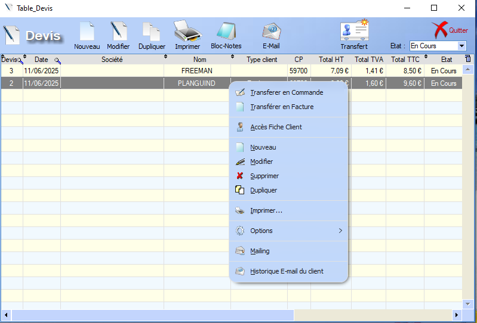
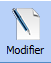
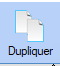
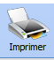
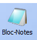
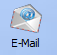
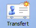

# Devis 

## Fiche devis

  L'outil **loupe** permet de rechercher , colonne par colonne, une valeur au sein de la table.

Un devis contient deux points d'informations principaux : 

- [Client](../client/ficheClients.md)
  
  > L'ajout d'un client à une commande peut se faire via son nom, par sa société ou par son code. Il est également possible de créer un nouveau client directement via la fiche commande   , ou d'en choisir un existant  .
  
- [Produits / Prestations]()

  > Ce bouton permet d'ajouter un produit à la liste de produits existants. Il est également possible d'ajouter un produit via un scan du code-barres.
  >
  >    L'outil crayon permet d'ajouter un produit _à la main_ au sein de la commande.
  >
  >  On peut également supprimer un produit de la commande via ce bouton 

Les différents renseignements restant sont **explicites**. Il est également possible d'ajouter des **observations** (visibles ou non par le client) au devis.

## Liste des devis

Une fois un ou plusieurs devis créées. L'utilisateur peut accéder à la **liste des devis** :

  L'outil **loupe** permet de rechercher , colonne par colonne, une valeur au sein de la table.

Depuis cette liste, l'utilisateur peut interagir avec les devis déjà créés. 

 Le bouton modifier donne accès à la **fiche du devis** . 

 Le bouton dupliquer permet de créer une **copie** du devis sélectionné et de l'ajouter à la liste. 

  Le bouton Imprimer permet la génération d'une **version pdf**du devis, destinée à l'impression. 

 Le bloc notes permet d'ajouter des **commentaires**, reliés à un devis. 

  Le bouton e-mail permet d'envoyer la version pdf du devis par **mail**.

## Transfert

Un devis permet de générer la [Commande](commande.md) ainsi que la [Facture](facture.md) associée.

>  Cette génération se fait via ce bouton  

