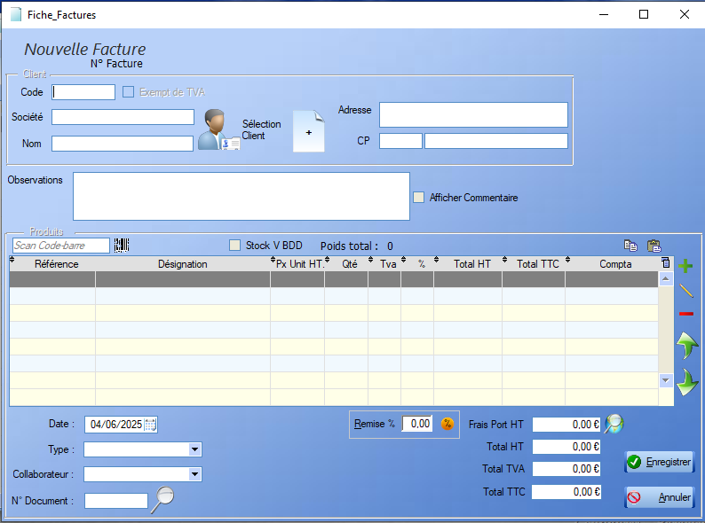

# Facture

## Fiche Facture

Une facture se construit de la même manière qu'un [devis](devis.md) : 

  L'outil **loupe** permet de rechercher , colonne par colonne, une valeur au sein de la table.

## Liste des factures

  L'outil **loupe** permet de rechercher , colonne par colonne, une valeur au sein de la table.

On retrouve un certain nombre de fonctionnalité connues et définies dans la section [Devis](devis.md).

  Pour les **Factures**, le logiciel permet d'ajouter un ou plusieurs règlements via le bouton . 

Une fois un règlement ajouté à la facture, celle-ci est considérée comme partiellement réglée. Quand la somme des règlements atteint le montant de la facture, celle-ci est considérée comme acquittée. Quand la facture provient d'une [Commande](#commande) pour laquelle un acompte a été versé, il est possible de laisser le reste du règlement en suspens, en refusant de  reprendre la saisie :  .

## Transfert

Une [Facture](facture.md) permet la génération de l'[Avoir](avoir.md) associé.

 
