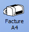
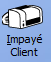
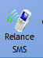

# Règlements an attente

L'outil **Règlements en attente** liste les différentes factures attendant un règlement. La liste contient également les avoirs dont le montant n'a pas encore été intégralement dépensé, le montant restant à dépenser étant indiqué en négatif.

Une liste d'outils servant à relancer les clients concernés par ces règlements est disponible via ce menu .

- On peut générer une facture via .

- On peut générer un Impayé client, indiquant la somme totale que le client doit actuellement à l'entreprise, via .

- On peut générer une lettre de relance via .

  > Il existe deux modèles de lettres de relance. Le modèle 1 correspond à une première relance, tandis que le modèle 2 sert de dernier avertissement avant l'initiation de procédures judiciaires.

- On peut effectuer une relance par e-mail via le bouton . Cette option génère un mail possèdant en pièce jointe une facture ou une lettre de relance, au choix.

- La relance SMS  permet de sélectionner les clients à relancer et de les joindre via leur téléphone portable.