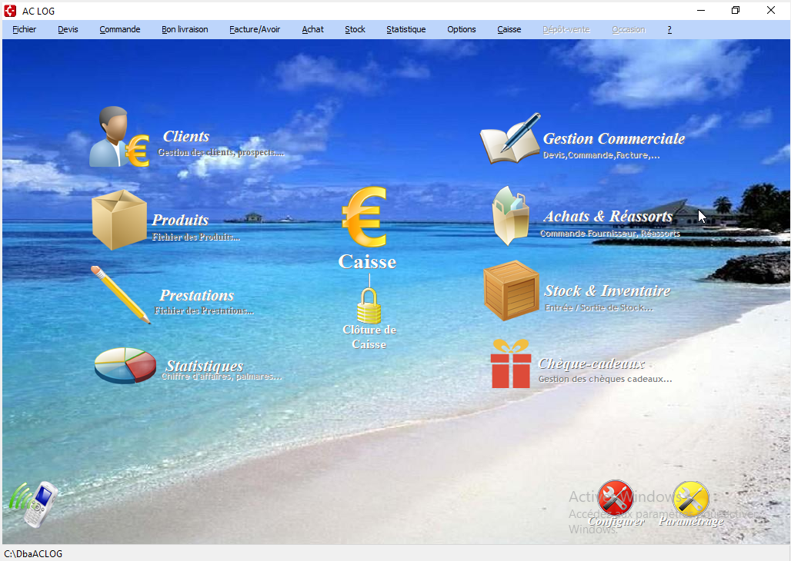
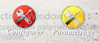

# Interface du logiciel

Cette section présente les différents aspects du menu principal et explique comment naviguer efficacement dans celui-ci.

## Accueil et navigation

Au lancement, le logciel présente l'interface suivante : 

## Présentation des icônes principales

  : Conduit vers le menu de gestion/création des [Clients](client/ficheClient.md)

  : Conduit vers le menu de gestion/création des [Produits](produits/ficheProduits.md) 

 : Conduit vers le menu de gestion/création des [Prestations](prestations/fichePrestations.md)

 : Conduit vers le menu des [Statistiques](stats.md)

  : Conduit vers le menu de la [Caisse](caisse.md)

  : Conduit vers le menu servant à la [clôture de caisse](cloture.md)

  : Conduit vers le menu de [Gestion commerciale](gestion/devis.md)

 : Conduit vers le menu de réassort, celui des [fournisseurs](fournisseurs/ficheFournisseur.md) et celui des [commandes aux fournisseurs](cmdFournisseurs/listeCmdFour.md)

  : Conduit vers le menu de gestion des [stocks](stock/etatStock.md)

  : Conduit vers le menu de gestion des [Chèque-cadeaux](chequeCadeaux/ficheCheques.md)

  : Permet de modifier les paramètres du [paramètrage initial](parametrage.md)

 : Permet le lancement d'une [campagne SMS](client/ficheClient.md#mailing-sms)

## Logique d'utilisation générale du logiciel

