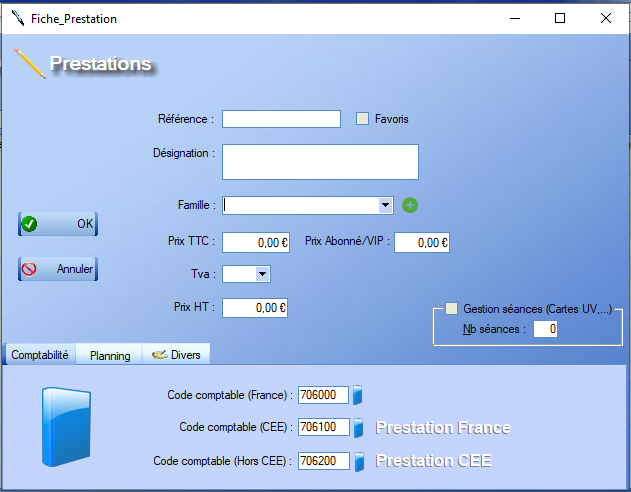
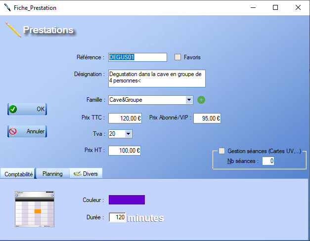

# Fiche Prestation

## Description

La fiche prestation regroupe tous les éléments caractérisant la prestation. Celle-ci est utilisée lors de la **création** d'une nouvelle prestation mais également lorsque l'utilisateur souhaite **modifier** celle-ci.

La référence sélectionnée par l'utilisateur doit être **unique**.

Les prestations peuvent être regroupées par **famille**.

  Ce bouton permet la création d'une nouvelle **famille**. Chaque famille doit être munie d'un **libellé** ainsi que d'une **couleur** choisie par l'utilisateur.

Différents **onglets** nous sont proposés au bas de cette fiche :

- L'onglet _Comptabilité_ permet la définition des différents **codes comptables** liés à la prestation.

  > Un **clic** sur ce logo permet d'accéder à la liste des codes comptables associés aux prestations. Pour plus d'information sur la comptabilité, voir la section [Comptabilité](?)

- L'onglet _Planning_ permet de définir la **durée** de la prestation (en minutes) et de choisir sa couleur lors de l'affichage du planning.

- L'onglet _Divers_  **A completer**

## Exemple de fiche complète

 