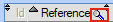

# Liste Prestations

Au lancement, l'interface de gestion des **prestations** nous affiche la table des prestations : 

  L'outil **loupe** permet de rechercher , colonne par colonne, une valeur au sein de la table.

Plusieurs **fonctionnalités** s'offrent à l'utilisateur depuis la table .

## Nouveau

Un **clic** permet de générer une nouvelle [Fiche Prestation](fichePrestations.md) et de l'enregistrer dans la table.

## Modifier

Un **clic** permet l'ouverture de la [Fiche Prestation](fichePrestations.md) sélectionnée en mode **édition**.

## Supprimer

Un **clic** permet de supprimer la prestation sélectionnée de la table.
