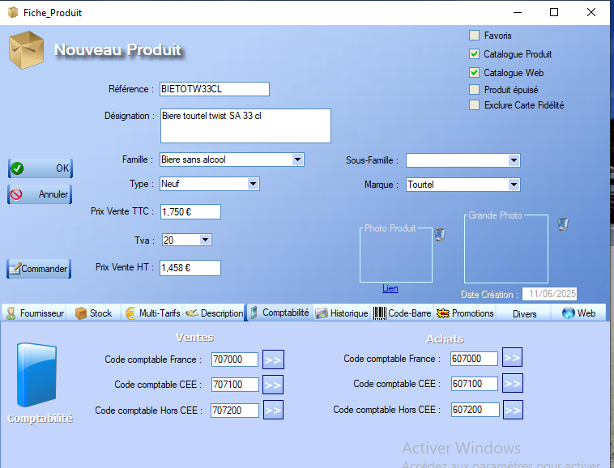
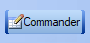
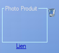
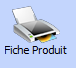

# Fiche Produit

La fiche produit permet la **création/modification** d'un produit et contient toutes sortes de renseignements explicites liés au produit :

La référence choisie par l'utilisateur doit être **unique**.

L'interface nous offre la possibilité de définir une **famille** de produits (principale et secondaire). Pour ce faire, il suffit de renseigner un **intitulé** désignant la famille ainsi qu'une **couleur** associée. La création de différentes **familles** de produits permet de définir des **catégories tarifaires**, ainsi que de **filtrer** l'affichage des produits dans les différents menus.

Le bouton _commander_ permet de [commander](../cmdFournisseurs/listeCmdFour.md) ce produit auprès d'un fournisseur.

  Cet encart permet, par un **clic** de l'utilisateur dans le carré, d'ajouter une photo au produit. 

 Ce bouton permet de **supprimer** cette image.

Au bas de la fiche, un certain nombre d'**onglets** s'offrent à l'utilisateur :

- l'onglet _Fournisseur_ permet de relier le produit directement à un [Fournisseur](../fournisseurs/ficheFournisseur.md) et de spécifier les modalités de vente de celui-ci.

- l'onglet _Stock_ permet de gérer les informations reliées au [Stock](../stock/etatStock.md), les Qté Mini et Maxi mettant en place des **seuils** bloquant certaines interactions via d'autres menus (la vente d'un produit en dessous du stock minimal par exemple)

- L'onglet _Multi-Tarifs_ permet de visualiser et de modifier les tarids des plusieurs **catégories tarifaires** définies dans l'outil **configurer** depuis l'[interface](../interface.md), sélectionnables par la suite depuis la [caisse](../caisse.md) lors d'une vente. 

    Ce boutonpermet l'impression d'une fiche regroupant ces **catégories tarifaires**. 

    Ce bouton permet de **dupliquer** une catégorie tarifaire.

- L'onglet _Description_ permet d'ajouter des annotations au produit via un éditeur de texte.

- L'onglet _Comptabilité_ permet de définir les différents codes comptables du produit.

- L'onglet _Historique_ nous donne accès à la liste de toutes les entrées/sorties du produit dans le [stock](../stock/etatStock.md).

- L'onglet _Code-barre_ nous donne accès à la visualisation du **code-barres** de ce produit.

- L'onglet _Promotions_ permet de définir une promotion temporaire sur le produit. Le bouton  permet de **supprimer** cette promotion.

- L'onglet _Divers_ permet beaucoup de réglages avancés sur le produit. Chaque champ est explicite.

- L'onglet _Web_ permet de paramétrer les informations du produit visibles sur le **catalogue web**.