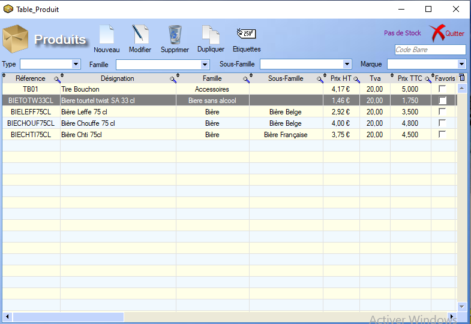
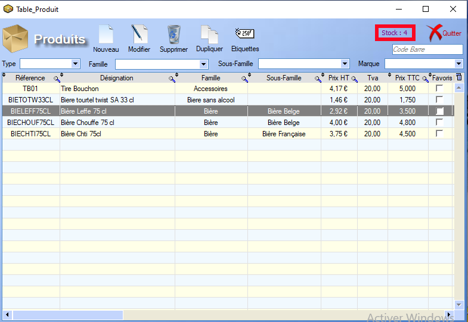
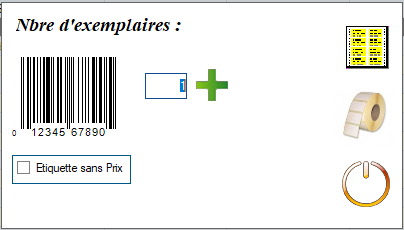
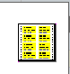
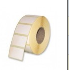
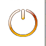

# Liste Produits

Le menu **Produits** nous donne accès à la liste des produits déjà enregistrés :

En haut à droite, en violet, l'interface nous indique la quantité de produits encore en stock : 

Les champs en haut du tableau nous permettent de **filtrer** l'affiche des produits en fonction des caractéristiques _Type, Famille, Sous-famille et Marque_ définies dans la [Fiche Produit](ficheProduits.md).

## Nouveau

Permet la création d 'un nouveau produit via la cosntruction d'une nouvelle [Fiche Produit](ficheProduits.md).

## Modifier

Ouvre la [Fiche Produit](ficheProduits.md) du produit sélectionné en mode _édition_.

## Supprimer

Supprime la ligne du tableau sélectionné, et le produit associé.

> /!\ Cela peut causer des incohérences dans les autres menus si le produit est impliqué dans des processus en cours.

## Dupliquer

Ouvre une nouvelle [Fiche Produit](ficheProduits.md), identique à celle du produit sélectionné.

## Etiquettes

Le menu étiquettes permet de générer des étiquettes correspondant au produit sélectionné :

Le bouton  permet d'imprimer ces étiquettes sous forme de **planche**, en indiquant où est ce que l'impression doit commencer sur la planche.

Le bouton  permet **A Compléter**.

Le bouton  permet de **quitter** le menu.

