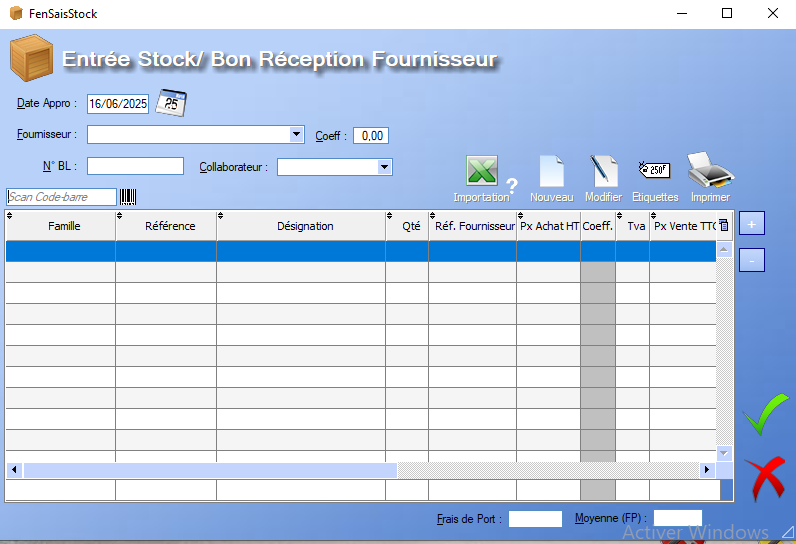
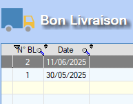
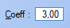
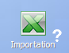

# Entrée de Stock

## Général

L'outil **Entrée de Stock** permet de documenter l'arrivée en stock d'une [Commande Fournisseur](../cmdFournisseurs/listeCmdFour.md). 

Le **N°BL** permet d'associer un [Bon de Livraison](../gestion/bdl.md) à l'entrée de stock. Ce renseignement se trouve dans la table des bons de livraison :

Une entrée de stock contient deux points d'informations importants.

- > [Fournisseur](../fournisseurs/ficheFournisseur.md)
  >
  > L'ajout d'un fournisseur à la commande peut se faire via les fournisseurs déjà enregistrés.
  >
  >  Ce champ permet de renseigner le coefficient de remise appliqué par le fournisseur (?).

- > [Produits](../produits/listeProduits.md)
  >   Ce bouton permet d'ajouter un produit déjà enregistré à la liste de produits existants. Il est également possible d'ajouter un produit via un scan du code-barres.
  >
  >   On peut également supprimer un produit de l'entrée de stock via ce bouton.
  >

 Le champ **frais de port** permet de renseigner les frais de port qui ont été réglés pour la commande au total.

Le champ **moyenne(FP)** calcule automatiquement la moyenne des frais de port en fonction du nombre de produits. 

Lorsqu'on **valide** l'entrée en stock. Le logiciel nous propose de générer le bon de réception en A4, mais également , si vous possédez un périphérique adapté, d'imprimer les **étiquettes** associées à chaque produit.

Plusieurs fonctionnalités s'offrent à l'utilisateur depuis le menu d'entrée des stocks : 

## Importation XLS

 Ce bouton permet de générer une entrée de stock **automatiquement** à partir d'un fichier XLS. Le fichier doit être ordonné de la manière suivante :

- Colonne 1 : référence du produit
- Colonne 2 : quantité de produits à entrer en stock
- Colonne 3 : prix d'achat du produit

## Nouveau

Un **clic** sur ce bouton permet de créer un nouveau produit directement dans **l'entrée de Stock** via sa [Fiche Produit](../produits/ficheProduits.md).

## Modifier

Un **clic** sur ce bouton permet d'ouvir la [fiche](../produits/ficheProduits.md) associée au produit sélectionné  en mode **édition**.

## Etiquettes

**A completer**

## Imprimer

Le bouton **Imprimer** génère un _Bon de Réception Fournisseur_ au format A4, celui-ci contenant toutes les infomrations définies par l'utilsiateur dans l'entrée de stock.

