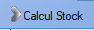

# Etat Stock

## Général

L'outil **Etat stock** permet simplement la visualisation de l'état actuel des stocks, en permettant également l'accès à quelques outils et l'établissement d'un **inventaire**.

    L'outil **loupe** permet de rechercher , colonne par colonne, une valeur au sein de la table.

L'utilisateur peut accéder, au-dessus de la table, à différents **filtres** permettant de n'afficher que les produits ayant des domaines d'appartenance précis.

  A la fin de cette liste de filtres se trouve l'outil **Calcul-Stock**. Cet outil offre plusieurs types de calculs :

- **Calcul stock total** : Somme les quantités de chaque produit et affiche le résultat à droite du bouton **Calcul-Stock**.
- **Calcul stock Taille-Coloris **: 
- **Calcul produit sélectionné** : Calcul 
- **Calcul valeur inventaire** : Calcule la valeur en Euros de la totalité de l'inventaire, en sommant les **prix d'achats**, et affiche le résultat à droite du bouton **Calcul-Stock**.
- **Calcul stock Virtuel** : Calcule , produit par produit, les stocks prévus une fois toutes les **transactions** en cours (commandes, commandes fournisseurs) finalisées. Le résultat s'affiche, ligne par ligne, dans la colonne **Qté Virtuel**.

Plusieurs fonctionnalités s'offrent à l'utilisateur en haut de la fenêtre :

## Entrée Stock

Ouvre l'outil [Entrée Stock](entreeStock.md).

## Sortie Stock

Ouvre l'outil [Sortie Stock](sortieStock.md).

## Fiche Produit

Ouvre la [Fiche Produit](../produits/ficheProduits.md) du produit sélectionné en mode **édition**.

## Inventaire

L'outil **Inventaire** permet de générer des documents d'inventaire au format A4. Plusieurs types d'inventaires peuvent être générés:

- **Inventaire** : Liste tous les produits.
- **Inventaire (sans stock à zéro)** : Liste tous les produits dont la quantité en stock est strictement supérieure à zéro.
- **Inventaire fournisseur** : Liste tous les produits, en les triant en fonction des fournisseurs proposant ces produits à la vente
- **Inventaire code-barre** : Liste tous les produits, en affichant leur code-barre dans la colonne de gauche.

**Attention** : Peu importe le type d'inventaire choisi, le fichier généré réportorie uniquement les produits visibles sur la table. De ce fait, les filtres sélectionnées dans la table d'état des stocks seront aussi actifs lors de la génération de l'inventaire.

