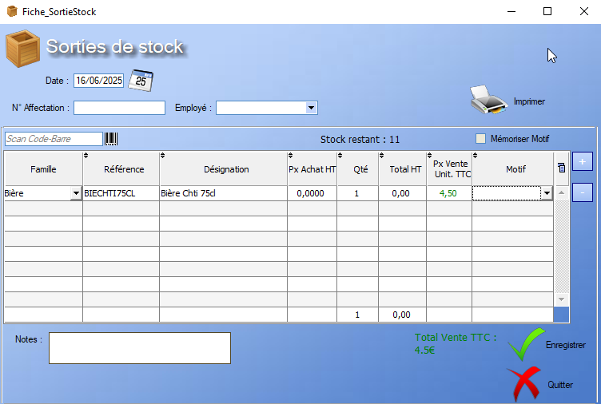

# Sortie Stock

## Général

L'outil **Sortie de Stock** permet de documenter et de prendre en compte au sein du logiciel la perte de produits, quand celle-ci n'est pas liée à une vente.

Employé, affectation : **A compléter**.

La liste des [Produits](../produits/listeProduits.md) quittant le stock se construit à l'aide des boutons situès à droite de la table :
>  Ce bouton permet d'ajouter un produit déjà enregistré à la liste de produits existants. Il est également possible >d'ajouter un produit via un scan du code-barres.
>
>  On peut également supprimer un produit de la sortie de stock via ce bouton.

Le champ **Motif** permet de renseigner la cause de la sortie de stock, produit par produit. Par défaut, le logiciel offre le choix entre _Défecteux_ et _Vol_ mais il est possible de rajouter des motifs dans la catégorie **Motif** du menu _Configurer_ disponible sur l'écran d'accueil.

## Imprimer

L'outil **Imprimer** permet de générer un document imprimable au format A4, listant les différents produits quittant le stock et affichant leur code-barre sur la gauche de l'écran.

